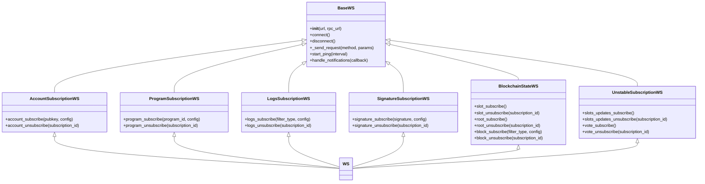

# Unofficial SDK

After not really finding a python wrapper around the WS and RPC API that suited my needs, I wrote one. Partially.

# API

All the RPC and WS endpoints have been mapped to their respective python functions and have been grouped together on the basis of functionality.

# Examples

## RPC API

This is how you'd use the RPC API

```py
from sdk.rpc import RPC

# Initialize the client with your API key
rpc = RPC("API_KEY")

# Using the Account API
balance = rpc.account.get_balance("KEY")
account_info = rpc.account.get_account_info("KEY")
multi_accounts = rpc.account.get_multiple_accounts(
    [
        "KEY1",
        "KEY2",
    ]
)
program_accounts = rpc.account.get_program_accounts("KEY")

# Using the Block API
block = rpc.block.get_block(430)
block_time = rpc.block.get_block_time(430)
blocks = rpc.block.get_blocks(100, 150)
block_height = rpc.block.get_block_height(commitment="finalized")

# Using the Cluster API
nodes = rpc.cluster.get_cluster_nodes()
epoch_info = rpc.cluster.get_epoch_info()
slot = rpc.cluster.get_slot()
identity = rpc.cluster.get_identity()
health = rpc.cluster.get_health()

# Using the Token API
token_balance = rpc.token.get_token_account_balance("KEY")
token_accounts = rpc.token.get_token_accounts_by_owner(
    "KEY",
    program_id="PROGRAM_ID",
)
token_supply = rpc.token.get_token_supply("MINT")

# Using the Transaction API
latest_blockhash = rpc.transaction.get_latest_blockhash()
signatures = rpc.transaction.get_signatures_for_address(
    "Vote111111111111111111111111111111111111111", limit=5
)
transaction_details = rpc.transaction.get_transaction("SIGNATURE")
tx_count = rpc.transaction.get_transaction_count()

# Using the Staking API
inflation_rate = rpc.staking.get_inflation_rate()
supply = rpc.staking.get_supply()
vote_accounts = rpc.staking.get_vote_accounts()

# Using the Performance API
performance_samples = rpc.performance.get_recent_performance_samples(10)
```

and this is how you'd use the WS API:

```py
from sdk.ws import WS
import asyncio


async def main():
    client = WS("wss://mainnet.-rpc.com", "API_KEY")
    await client.connect()

    sub_id = await client.account_subscribe(
        "PUB_KEY",
        {"encoding": "jsonParsed", "commitment": "finalized"},
    )

    async def handle_notification(data):
        print(f"Received: {data}")
        print("")

    await client.handle_notifications(handle_notification)


if __name__ == "__main__":

    asyncio.run(main())
```

# Class structure:

## RPC:

```mermaid
classDiagram
    RPC *-- AccountAPI
    RPC *-- BlockAPI
    RPC *-- ClusterAPI
    RPC *-- TokenAPI
    RPC *-- TransactionAPI
    RPC *-- StakingAPI
    RPC *-- PerformanceAPI

    APIBase <|-- AccountAPI
    APIBase <|-- BlockAPI
    APIBase <|-- ClusterAPI
    APIBase <|-- TokenAPI
    APIBase <|-- TransactionAPI
    APIBase <|-- StakingAPI
    APIBase <|-- PerformanceAPI

    class RPC {
        +string url
        +dict headers
        +AccountAPI account
        +BlockAPI block
        +ClusterAPI cluster
        +TokenAPI token
        +TransactionAPI transaction
        +StakingAPI staking
        +PerformanceAPI performance
        +__init__(rpc_url)
        -_make_request(method, params)
    }

    class APIBase {
        +RPC client
        +__init__(client)
        #_make_request(method, params)
    }

    class AccountAPI {
        +get_account_info(pubkey, encoding, commitment)
        +get_balance(pubkey, commitment)
        +get_multiple_accounts(pubkeys, encoding, commitment)
        +get_program_accounts(programId, encoding, filters, commitment)
        +get_minimum_balance_for_rent_exemption(data_size, commitment)
        +request_airdrop(pubkey, lamports, commitment)
    }

    class BlockAPI {
        +get_block(slot, encoding, transaction_details, commitment)
        +get_block_commitment(block)
        +get_block_height(commitment, min_context_slot)
        +get_block_production(identity, first_slot, last_slot, commitment)
        +get_block_time(block)
        +get_blocks(start_slot, end_slot, commitment)
        +get_blocks_with_limit(start_slot, limit, commitment)
        +get_first_available_block()
        +minimum_ledger_slot()
        +get_highest_snapshot_slot()
    }

    class ClusterAPI {
        +get_cluster_nodes()
        +get_epoch_info(commitment, min_context_slot)
        +get_epoch_schedule()
        +get_genesis_hash()
        +get_health()
        +get_identity()
        +get_version()
        +get_slot(commitment, min_context_slot)
        +get_slot_leader(commitment, min_context_slot)
        +get_slot_leaders(start_slot, limit)
        +get_max_retransmit_slot()
        +get_max_shred_insert_slot()
    }

    class TokenAPI {
        +get_token_account_balance(pubkey, commitment)
        +get_token_accounts_by_delegate(delegate, mint, program_id, encoding, commitment)
        +get_token_accounts_by_owner(owner, mint, program_id, encoding, commitment)
        +get_token_largest_accounts(mint, commitment)
        +get_token_supply(mint, commitment)
    }

    class TransactionAPI {
        +get_fee_for_message(message, commitment)
        +get_latest_blockhash(commitment, min_context_slot)
        +get_recent_prioritization_fees(addresses)
        +get_signature_statuses(signatures, search_transaction_history)
        +get_signatures_for_address(address, before, until, limit, commitment)
        +get_transaction(signature, encoding, commitment)
        +get_transaction_count(commitment, min_context_slot)
        +is_blockhash_valid(blockhash, commitment, min_context_slot)
        +send_transaction(transaction, opts)
        +simulate_transaction(transaction, opts)
    }

    class StakingAPI {
        +get_inflation_governor(commitment)
        +get_inflation_rate()
        +get_inflation_reward(addresses, epoch, commitment, min_context_slot)
        +get_largest_accounts(filter_type, commitment)
        +get_stake_minimum_delegation(commitment)
        +get_supply(commitment, exclude_non_circulating_accounts_list)
        +get_vote_accounts(commitment, keep_unstaked_delinquents)
    }

    class PerformanceAPI {
        +get_recent_performance_samples(limit)
    }
```



## WS:


